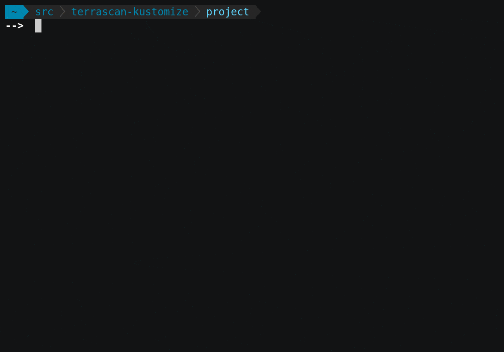

Most organizations -- in fact, [over 78%](https://www.cncf.io/wp-content/uploads/2020/08/CNCF_Survey_Report.pdf) -- leverage Kubernetes in their move to cloud-native applications.  This powerful and flexible platform enables teams to deploy and manage sophisticated systems while delivering innovation to market faster than ever.  Unfortunately, that power and flexibility often requires significant care and effort, especially as apps migrate through their lifecycle.  Each new environment may require configuration and connectivity changes which need to be tracked and managed.

[Kustomize](https://kustomize.io/) helps teams address these challenges by providing a way to tweak configurations based on declarative overrides.  It works great for building environment-specific configurations into automated processes without adding brittle pre-processing steps or managing external properties and templates.

Given the popularity of Kustomize and Kubernetes -- they are regularly downloaded millions of times each month -- we’re excited to include support for both Kustomize and Kubernetes in [release 1.2.0](https://github.com/accurics/terrascan/releases/tag/v1.2.0) of Terrascan.

[Terrascan](https://www.accurics.com/products/terrascan/) is an open, extensible architecture that enables teams to enforce policies and compliance in numerous types of IaC, and has supported Kubernetes for some time now.  With the addition of Kustomize support, it now has a better understanding of those configurations and can deliver more accurate and relevant results.  [Policy as Code](https://www.accurics.com/products/accurics/policy-as-code/) guardrails are a best practice for cloud native development, and this is just one more example of Terrascan’s commitment to delivering that capability for the most popular technologies.

## Kustomize and Terrascan: Getting Started
Getting started with Terrascan is easy, regardless of whether you use the portable Go binary, a Docker container, or you build from source.  The command line interface works well in many contexts, regardless of whether you want to run from a shell, a script, or in a pipeline.

Start in the directory where your Kustomize project is stored and launch Terrascan:

```
~ terrrascan scan -i kustomize
```

Kustomize support is implemented as a new IaC provider, leveraging Terrascan’s extensible architecture.  The “scan” command will scan the infrastructure, and the “-i” option enables the Kustomize IaC provider.



Terrascan defaults to scanning from the current directory, and you can add the -d option one or more times if you would like to scan other directories.  The output will be sent to the terminal in YAML format by default, and includes a summary of the results as well as the details needed to prioritize and fix the findings.  The structured output works well for programmatic processing and is easy for humans to read.

Please tell us what you’d like to see next!  Feedback is always welcome in our [Community Discord](https://discord.gg/accurics-community) or via [Terrascan GitHub Issues](https://github.com/accurics/terrascan/issues).
