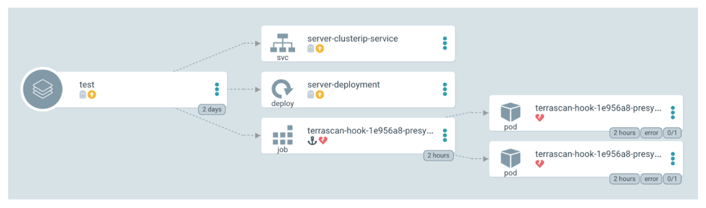

Among their many advantages, GitOps pipelines enable teams to run automated security tests using codified policies. Since your Git repository reflects your infrastructure configurations, scanning your Infrastructure as Code (IaC) repository is a straightforward way to find and fix security vulnerabilities as part of local development cycles. 

Terrascan, a leading open-source static code analyzer for cloud technologies like Terraform, Helm, Docker, Kubernetes (K8) and others, has had the ability to scan and test IaC repositories for some time. It's ideal for teams who are -- or want to -- add security checks to the code they use to provision cloud and on-prem systems. This practice is what's commonly known as _Policy as Code_.

One of the key advantages of Terrascan is the ability to scan code throughout its lifecycle, on developer workstations, in Git repositories, Kubernetes admissions controllers and in CI/CD pipelines. This empowers DevOps teams to integrate Terrascan into their workflows and apply the same policies used to enforce policies in production environments. Using the same tool, with the same policies, ensures security and consistency across the GitOps pipeline and prevents code-to-cloud drift.

GitOps is a framework that takes the automation and best practices from the world of application development into the world of cloud-native infrastructure. [Argo CD](https://argo-cd.readthedocs.io/en/stable/) is a GitOps CI/CDtool for Kubernetes. In a GitOps pipeline, infrastructure is codified, collaborated upon and version controlled. Like application code, infrastructure is codified and stored in a Git repo, and a tool such as Argo CD is responsible for ensuring that infrastructure remains synchronized with the Git repository.

_Figure 1. GitOps security using the Argo CD workflow with Terrascan policy as code._

Integrating security testing into an Argo CD workflow is easy using Terrascan. 

You start by setting up a single instance of Terrascan, and connecting both your Argo CD and Kubernetes cluster to it. Once connected, you're be able to leverage consistent configurations and establish thresholds that trigger CI/CD events. For example, you can set which policy violations will break an Argo continuous-delivery build or reject admission to the Kubernetes cluster.

If you are only interested in code-scanning -- or you have a specialized need -- you can add your own policies and apply them to both your Argo repository and your Kubernetes cluster. Unlike other tools powered by the Open Policy Agent (OPA), no other adapters are necessary. Terrascan achieves this by standardizing the input around the same policy, regardless of the target. You can also use hundreds of built-in standard Terrascan policies, or mix and match as desired.

Wondering why you should trigger security controls in both the CD workflow and at admission to your Kubernetes cluster? The answer is that changes to the cluster can be made by tools other than your CD tool, either by mistake or by malice. The admission controller is your defense against those threats, but for ease of maintenance and remediation, it is best not to rely on the admission controller alone for recurring workflows. Rather, it's a best practice to leverage your CD tooling for integrated tests. 

Terrascan provides 500+ out-of-the-box policies so you can scan IaC against common policy standards such as the CIS Benchmark. Terrascan leverages the OPA engine so you can easily create custom policies using the Rego query language. If you're new to Terrascan, you can play around with it in the online sandbox at [tenable.com/terrascan](https://tenable.com/terrascan).

For more information, please check out the [Argo CD integration folder](https://github.com/tenable/terrascan/tree/master/integrations/argocd) in our public Git repo, and check out the documentation. The Terrascan team is committed to building in public, and this is just the beginning of our GitOps story. We would love to hear from you on our [Github repo](https://github.com/tenable/terrascan).
